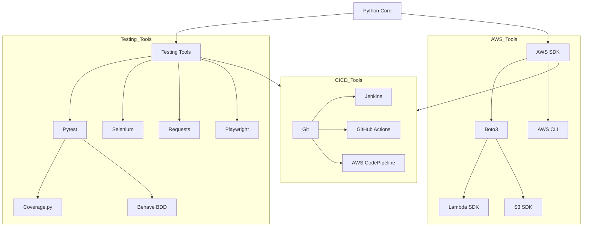
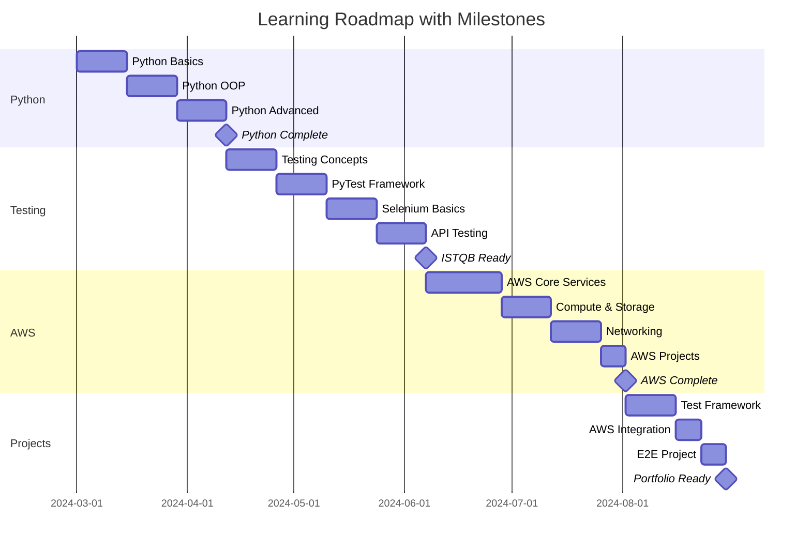

# QA Automation Learning Path
> A comprehensive guide to learning Automated QA with Python and AWS

## 📋 Table of Contents
- [Overview](#overview)
- [Learning Path](#learning-path)
- [Tools and Dependencies](#tools-and-dependencies)
- [Detailed Roadmap](#detailed-roadmap)
- [Milestones](#milestones)
- [Resources](#resources)
- [Project Structure](#project-structure)

## Overview
This repository documents my learning journey in becoming a QA Automation Engineer, focusing on:
- Python Programming
- Test Automation
- AWS Cloud Services
- Integration Projects

## Learning Path

### Tools Dependencies


### Learning Roadmap

```mermaid
graph LR
    Start((Start)) --> Python[Python Fundamentals]
    
    subgraph Phase1[Phase 1: Python 4-6 weeks]
        Python --> PythonBasics[Basic Syntax]
        PythonBasics --> PythonOOP[OOP]
        PythonOOP --> PythonAdvanced[Advanced Concepts]
    end
    
    subgraph Phase2[Phase 2: QA Automation 6-8 weeks]
        PythonAdvanced --> TestingBasics[Testing Fundamentals]
        TestingBasics --> PyTest[PyTest Framework]
        PyTest --> Selenium[UI Automation]
        Selenium --> API[API Testing]
    end
    
    subgraph Phase3[Phase 3: AWS 6-8 weeks]
        API --> AWSBasics[AWS Fundamentals]
        AWSBasics --> Compute[Compute Services]
        Compute --> Storage[Storage Services]
        Storage --> Network[Networking]
    end
    
    subgraph Phase4[Phase 4: Integration 4 weeks]
        Network --> Project1[Basic Test Project]
        Project1 --> Project2[AWS Testing Project]
        Project2 --> Project3[E2E Project]
    end
    
    Project3 --> Complete((Complete))
    
    M1[Python Certified] --> PythonAdvanced
    M2[ISTQB Foundation] --> API
    M3[AWS Cloud Practitioner] --> Network
```


### Milestone Timeline


## Detailed Curriculum

### 1. Python Fundamentals (4-6 weeks)
#### Basics:
- Python syntax and data types
- Variables and operators
- Control structures (if/else, loops)
- Functions and modules
- Lists, tuples, dictionaries, and sets
- File handling

#### Intermediate:
- Object-Oriented Programming (OOP)
- Exception handling
- Working with libraries and pip
- Virtual environments
- Regular expressions
- List comprehensions and generators

### 2. Automated QA Fundamentals (6-8 weeks)
#### Testing Basics:
- Software testing principles
- Test types (Unit, Integration, System, E2E)
- Test pyramids and strategies
- Bug reporting and tracking

#### Python Testing Tools:
- PyTest framework
- Unittest framework
- Test fixtures and parameterization
- Mocking and patching
- Test coverage with coverage.py

#### Test Automation:
- Selenium WebDriver with Python
- Playwright
- API testing with requests library
- Performance testing with Locust
- Behavior-Driven Development (BDD) with Behave

### 3. AWS Fundamentals (6-8 weeks)
#### Core Concepts:
- Cloud computing basics
- AWS global infrastructure
- AWS management console
- IAM (Identity and Access Management)

#### Essential Services:
1. Compute:
   - EC2 (Elastic Compute Cloud)
   - Lambda
   - ECS (Elastic Container Service)

2. Storage:
   - S3 (Simple Storage Service)
   - EBS (Elastic Block Store)
   - EFS (Elastic File System)

3. Database:
   - RDS (Relational Database Service)
   - DynamoDB

4. Networking:
   - VPC (Virtual Private Cloud)
   - Route 53
   - CloudFront

## Milestones

### Milestone 1: Python Basics Complete (Week 6)
**Required Skills:**
- ✓ Python syntax mastery
- ✓ OOP concepts implementation
- ✓ Data structures & algorithms basics
- ✓ File handling & error management
- ✓ Basic scripting capabilities

**Validation:**
- Complete 2-3 basic Python projects
- Pass basic Python coding challenges
- Create GitHub repository with examples

### Milestone 2: Testing Fundamentals Complete (Week 14)
**Required Skills:**
- ✓ Testing principles & methodologies
- ✓ PyTest framework proficiency
- ✓ Selenium WebDriver basics
- ✓ API testing with requests
- ✓ Test case design & execution

**Validation:**
- ISTQB Foundation exam readiness
- Working test automation framework
- API test suite implementation

### Milestone 3: AWS Fundamentals Complete (Week 20)
**Required Skills:**
- ✓ AWS core services understanding
- ✓ EC2, S3, RDS usage
- ✓ AWS CLI & SDK usage
- ✓ Basic cloud architecture
- ✓ IAM & security fundamentals

**Validation:**
- AWS Cloud Practitioner exam readiness
- Deploy basic applications on AWS
- Implement AWS automation scripts

### Milestone 4: Integration Complete (Week 24)
**Required Skills:**
- ✓ Complete test automation framework
- ✓ Cloud-based test execution
- ✓ CI/CD pipeline implementation
- ✓ Cross-browser testing
- ✓ Comprehensive reporting

## Resources

### Python Learning
- [Python.org Official Tutorial](https://docs.python.org/3/tutorial/)
- [Automate the Boring Stuff with Python](https://automatetheboringstuff.com/)
- [Real Python](https://realpython.com/)

### Testing Resources
- [PyTest Documentation](https://docs.pytest.org/)
- [Selenium with Python](https://selenium-python.readthedocs.io/)
- [ISTQB Foundation Level](https://www.istqb.org/)

### AWS Learning
- [AWS Free Tier](https://aws.amazon.com/free/)
- [AWS Documentation](https://docs.aws.amazon.com/)
- [AWS Certified Cloud Practitioner](https://aws.amazon.com/certification/certified-cloud-practitioner/)

## Project Structure
```
├── python_fundamentals/
│   ├── basics/
│   ├── oop/
│   └── advanced/
├── testing/
│   ├── pytest_examples/
│   ├── selenium_tests/
│   └── api_tests/
├── aws/
│   ├── compute/
│   ├── storage/
│   └── networking/
└── integration_projects/
    ├── test_framework/
    ├─��� aws_integration/
    └── e2e_project/
```

## Progress Tracking
- [ ] Python Fundamentals
  - [ ] Basic Syntax
  - [ ] OOP Concepts
  - [ ] Advanced Topics
- [ ] Testing Fundamentals
  - [ ] PyTest
  - [ ] Selenium
  - [ ] API Testing
- [ ] AWS Fundamentals
  - [ ] Core Services
  - [ ] Compute & Storage
  - [ ] Networking
- [ ] Integration Projects
  - [ ] Basic Framework
  - [ ] AWS Integration
  - [ ] E2E Project

## Contributing
Feel free to submit pull requests, create issues or spread the word.

## License
This project is licensed under the MIT License - see the [LICENSE](LICENSE) file for details.
